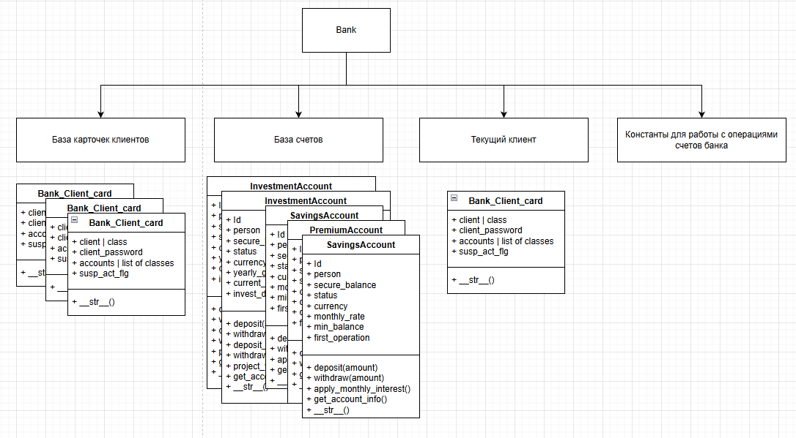
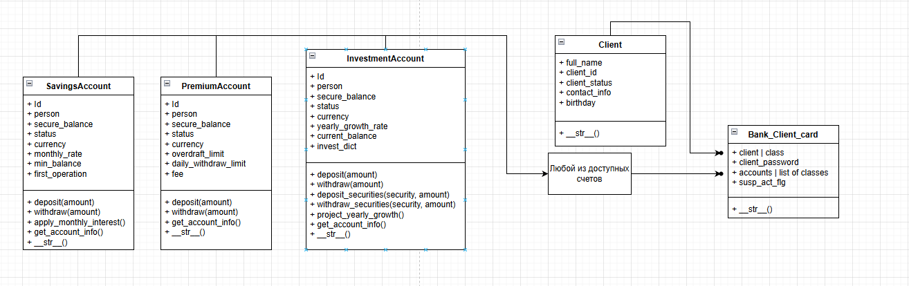

# Python_OOP
## Архитектура Банка

Банк хранит у себя список клиентов и список счетов. Также у него есть параметр "Текущий клиент", под которым осуществляются операции со счетами. Еще у банка есть свой перечень констанот, которые задают дополнительные настройки при работе с транзакциями. Визуально это выглядит так.

База счетов состоит из объектов различных классов, наследуемых из класса банковского счета. Дерево наследования выглядит так.

Для удобной работы с клиентами было решено зранить в базе клиентов не сами объекты класса "**Client**", а карточки этих клиентов. Эти карточки представляют собой экземпляр класса **Client** и дополнительные атрибуты, которые неробходимы Банку для выполнения транзакций.
На текущий момент карточка включает в себя:
    1. объект **Client**.
    2. пароль объекта.
    3. список счетов, которые принадлежат объекту.
    4. флаг подозрительной активности.
Графически это выглядит следующим образом:

Любая операция со счетом (транзакция) обязательно выполняется под текущим пользователем. 

Подробная информация о конфигурации банковских счетов представлена в документации Day2.3_Work_logic.

Подробная информация о банковской системе, работы с клиентами и осуществления транзакций описана в документации Day3.3_Work_logic.