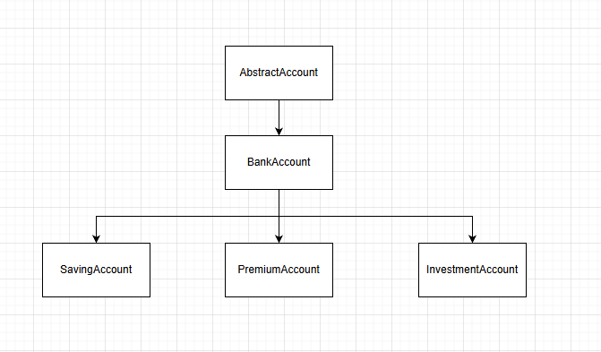
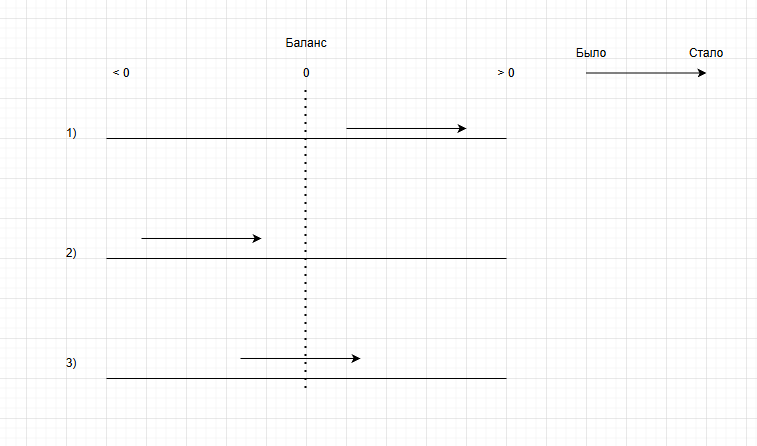

# Логика программы Day2
Логика работы 1 дня остается неизменной, функционал по 2 дню в блоке кода представлен ниже.

## BankAccount
### Блок статических переменных
Предназначен  для редактирования параметров в программе. Удобно менять настройки проекта в одном месте.
**STATUS** - перечислены возможные правильные статусы счета
**RANDOM_ID_LEN** - в случае автоматической генерации ID счета задается длина этого ID (кол-во символов в нем)
**CURRENCY_MEANINGS** - доступные валюты счета

### Атрибуты
    Id,                 уникальный идентификатор счёта (наследуемый)
    person,             данные владельца (наследуемый) 
    secure_balance,     защищённый баланс (наследуемый)
    status,             статус счёта (наследуемый)
    currency            тип валюты (новый)

### Методы
**def validate_operation(self, amount, oper_type)**
1. Принимает на вход сумму и тип операции
2. Проводит валидацию:
    * суммы на ее тип (должен быть числом)
    * статуса счета: нужные значения находятся в **STATUS**
    * типа операции: запрета снятия денег со счета с уходом в отрицательный баланс

**def deposit(self, amount)**
1. Принимает на вход сумму
2. Вызывает validate_operation для проверки входного аргумента
3. Зачисляет средства на счет

**def withdraw(self, amount)**
1. Принимает на вход сумму
2. Вызывает validate_operation для проверки входного аргумента
3. Списывает средства со счета

**def get_account_info(self)**

Вывод служебной информации

**def __str__(self)**

Вывод информации о счете клиенту. Номер счета зашифрован * кроме последних 4 символов согласно заданию.

## SavingsAccount

### Атрибуты
    Id,                 уникальный идентификатор счёта (наследуемый)
    person,             данные владельца (наследуемый) 
    secure_balance,     защищённый баланс (наследуемый)
    status,             статус счёта (наследуемый)
    currency            тип валюты (наследуемый)
    min_balance         минимальный остаток на счету (новый)
    monthly_rate        месячная ставка доходности (новый)

### Методы

**def deposit(self, amount)**
1. Наследуется из **BankAccount**
2. Зачисляет средства на счет

**def withdraw(self, amount)**
1. Наследуется из **BankAccount**
2. Пересчитывает минимальный остаток в случае необходимости
3. Списывает средства со счета

**def apply_monthly_interest(self)**
1. Рассчитывает месячный доход по ставке доходности и начисляет средства на счет
2. Пересчитывает минимальный остаток

**def get_account_info(self)**

Вывод служебной информации

**def __str__(self)**

Вывод информации о счете клиенту.

## PremiumAccount

### Атрибуты
    Id,                     уникальный идентификатор счёта (наследуемый)
    person,                 данные владельца (наследуемый) 
    secure_balance,         защищённый баланс (наследуемый)
    status,                 статус счёта (наследуемый)
    currency                тип валюты (наследуемый)
    overdraft_limit         показывает, на сколько еще можно уйти в минус (новый)
    daily_withdraw_limit    показывает, на сколько еще можно уйти в минус в день (новый)
    fee                     ставка комиссии за использование заемных средств (новый)

### Методы

**def deposit(self, amount)**
1. Наследуется из **BankAccount**
2. Зачисляет средства на счет:
    1. Если долга нет, зачисление происходит как обычно
    2. Если долг есть, то сначала гасится долг
    3. Если долг погашен, то остаток средств идет на пополнение счета

**def withdraw(self, amount)**
1. Принимает на вход сумму
2. Проверяет тип входного аргумента (число)
3. Списывает средства со счета
4. Проверка на использование заемных средств:
    * если после списания баланс счета неотрицательный, игнорируем этот шаг
    * если после списания баланс счета отрицательный, баланс счета приравниваем к 0, а разницу списываем из лимита заемных средств. Также списываем комиссию, которая начисляется **только на часть заемных средств** (например, если на счете 100р, а снимается 300р, то списывается 100р со счета + 200р замных средств + комиссия на 200р за возможность использования заемных средств)

**def get_account_info(self)**

Вывод служебной информации

**def __str__(self)**

Вывод информации о счете клиенту.

## InvestmentAccount

### Справочная информация
Брокерский счет. Есть валюта, есть бумаги.

Бумаги представляют собой словарь: наименование и кол-во вложенных средств.

Теперь у пользователя есть 4 действия: внести деньги на счет (в валюту), купить бумаги (из валюты в бумаги),
продать бумаги (из бумаги в валюту), вывести деньги (из валюты)

При создании брокерского счета автоматически открываются позиции на 'stocks', 'bonds' и 'etf'

### Атрибуты
    Id,                     уникальный идентификатор счёта (наследуемый)
    person,                 данные владельца (наследуемый) 
    secure_balance,         защищённый баланс (наследуемый)
    status,                 статус счёта (наследуемый)
    currency                тип валюты (наследуемый)
    yearly_growth_rate      процент, на который повышется общая стоимость портфеля (новый) 
    current_balance         баланс валюты (новый)
    invest_dict             словарь ценных бумаг и вложенных средств (новый)

### Методы

**def deposit(self, amount)**
1. Наследуется из **BankAccount**
2. Зачисляет средства на счет

**def deposit_securities(self,security, amount)**
1. Принимает на вход тип ценной бумаги и сумму на ее покупку со счета валюты
2. Нельзя купить несуществующую ценную бумагу
3. Нельзя купить ценную бумагу на сумму, превышающую баланс валюты

**def withdraw(self, amount)**
1. Наследуется из **BankAccount**
2. Проверяет, чтобы снимаемая сумма была не больше баланса валюты. Чтобы не запутаться, при обработке ошибки указывается доступная для снятия сумма.

**def withdraw_securities(self,security, amount)**
1. Принимает на вход тип ценной бумаги и сумму на ее продажу. Зачисление происходит на счет валюты
2. Если списываемая сумма больше баланса средств конкретной ценной бумаги, то списываются все доступные средства ценной бумаги на счет валюты. Баланс ценной бумаги становится нулевым
3. Нельзя списать сумма с несуществующей ценной бумаги

 **def project_yearly_growth(self)**
 
 Осуществляет рост баланса каждой ценной бумаги на процент, указанный в **yearly_growth_rate**

 **def get_account_info(self)**

Вывод служебной информации

**def __str__(self)**

Вывод информации о счете клиенту.